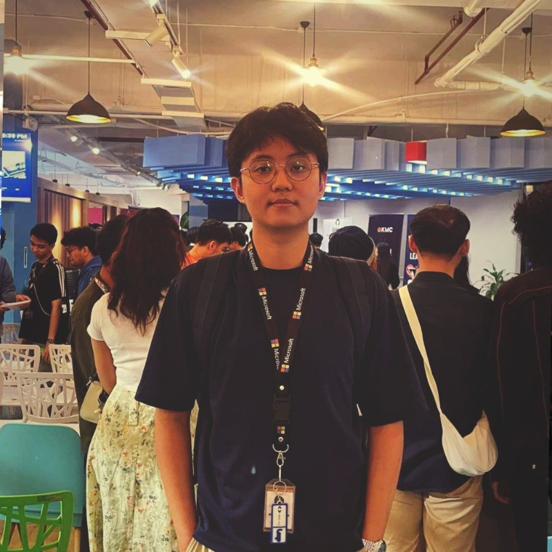

<div align="center">



# ✦ Arron Parejas — Personal Portfolio

**Software Engineer & AI Engineer · CEO of GDG on Campus HAU · 5× Hackathon Champion**

[](https://darknecrocities.github.io/Arron-Portfolio/)
[](https://www.linkedin.com/in/arron-parejas-6711b6289/)
[](https://github.com/darknecrocities)
[](https://www.instagram.com/rhonronkyah/)

</div>

---

## 📸 Preview

<div align="center">

| Desktop | Mobile |
|:---:|:---:|
|  |  |

</div>

---

## 📖 About

A personal portfolio website for **Arron Kian M. Parejas** — a passionate builder, technology leader, and problem-solver from Pampanga, Philippines. Currently pursuing a **Bachelor of Science in Computer Science** at Holy Angel University, Arron leads Google Developer Groups (GDG) on Campus HAU as its **Chief Executive Officer (2025–2026)** and has earned recognition as a **5× Hackathon National Champion**.

> *"Passionate about technology, innovation, and mentorship — building scalable solutions that create meaningful real-world impact."*

---

## 🗂️ Portfolio Sections

| Section | Description |
|---|---|
| 🧑 **About** | Personal introduction, services offered, testimonials, and brand partnerships |
| 📄 **Resume** | Education, work experience, and technical skills |
| 🖼️ **Gallery** | Showcase of notable projects with descriptions |
| 🏆 **Achievements** | Hackathon wins, certifications, and recognitions |
| 📝 **Blog** | Event highlights, research publications, and community milestones |
| 📬 **Contact** | Contact form and direct contact information |

---

## ✨ Features

- 🌗 **Dark / Light Mode Toggle** — Persistent theme preference saved to `localStorage`
- 🔄 **Dynamic GitHub Repos** — Fetches and renders live GitHub repositories via the GitHub REST API
- 🏅 **Certifications & Achievements** — Fully dynamic section powered by a structured data file
- 📚 **Blog Cards with Popups** — Expandable blog posts with rich content and media
- 📱 **Fully Responsive Design** — Optimised for desktop, tablet, and mobile viewports
- ⚡ **Smooth Animations & Transitions** — CSS transitions for hover states, section switches, and theme toggling

---

## 🛠️ Tech Stack

<div align="center">


</div>

| Layer | Technology |
|---|---|
| Markup | HTML5 |
| Styling | CSS3 (custom variables, flex, grid) |
| Scripting | Vanilla JavaScript (ES6+) |
| Icons | [Ionicons v7](https://ionic.io/ionicons) |
| Fonts | [General Sans](https://www.fontshare.com/) via Fontshare |
| Data Fetching | Node.js (`scripts/fetch-repos.js` → GitHub REST API) |

---

## 📁 Project Structure

```
Arron-Portfolio/
│
├── index.html                  # Main entry point
├── 2.png                       # Favicon
├── arron_parejas.pdf           # Downloadable CV / Resume
├── stackbit.config.ts          # Stackbit CMS configuration
│
├── assets/
│   ├── css/
│   │   ├── style.css           # Core styles & CSS variables (dark/light mode)
│   │   ├── certifications.css  # Achievements section styles
│   │   ├── github.css          # GitHub repos section styles
│   │   └── blogs.css           # Blog section styles
│   │
│   ├── js/
│   │   ├── script.js           # Core interactivity (nav, sidebar, theme toggle)
│   │   ├── certifications-app.js  # Renders certifications from data
│   │   ├── github-app.js       # Renders GitHub repos from data
│   │   └── blogs-app.js        # Renders blog cards & modal popups
│   │
│   ├── data/
│   │   ├── certifications.js   # Static certifications & hackathon data
│   │   ├── blogs.js            # Blog/event entries data
│   │   └── github-repos.js     # Pre-fetched GitHub repository data
│   │
│   └── images/                 # All images, icons, and project thumbnails
│
├── scripts/
│   └── fetch-repos.js          # Node.js script to refresh GitHub repos data
│
└── website-demo-image/
    ├── desktop.png             # Desktop screenshot
    └── mobile.png              # Mobile screenshot
```

---

## 🚀 Getting Started

### Prerequisites

- A modern web browser (Chrome, Firefox, Edge, Safari)
- [Node.js](https://nodejs.org/) *(only required if refreshing GitHub data)*

### Run Locally

```bash
# 1. Clone the repository
git clone https://github.com/darknecrocities/Arron-Portfolio.git

# 2. Navigate into the project
cd Arron-Portfolio

# 3. Open in browser
open index.html
# or simply double-click index.html
```

### Refresh GitHub Repository Data *(optional)*

```bash
# Fetches the latest repos from the GitHub API and writes to assets/data/github-repos.js
node scripts/fetch-repos.js
```

---

## 🏆 Achievements Highlight

| Award | Event | Year |
|---|---|---|
| 🥇 National Champion | Google UP: Build with AI Hackathon | 2025 |
| 🥇 Champion | SkyDev 2025 Hackathon | 2025 |
| 🥇 Champion | Caffeine AI Manila (Technical Track) | 2025 |
| 🥇 Champion | UNity 2025 Hackathon | 2025 |
| 🥇 Champion | SparkHub Online Hackathon | 2025 |
| 🥈 Finalist | Appcon 2024 Hackathon | 2024 |
| 🎖️ Top 1 Scholar | DataCamp Scholars — GDG HAU | 2025 |
| 🎖️ Rank #11 | Top GitHub Developers in the Philippines | 2025 |
| 🚀 CEO | Google Developer Groups on Campus — HAU | 2025–2026 |
| 🔬 Researcher | NeuroCare AI (Reinforcement Learning for Breast Cancer) | 2025 |

---

## 📬 Contact

| Channel | Details |
|---|---|
| 📧 Email | [parejasarronkian@gmail.com](mailto:parejasarronkian@gmail.com) |
| 📞 Phone | +63 9691379979 |
| 📍 Location | Pampanga, Philippines |
| 💼 LinkedIn | [arron-parejas-6711b6289](https://www.linkedin.com/in/arron-parejas-6711b6289/) |
| 🐙 GitHub | [darknecrocities](https://github.com/darknecrocities) |
| 📸 Instagram | [rhonronkyah](https://www.instagram.com/rhonronkyah/) |

---

## 📄 License

This project is open source and available under the [MIT License](LICENSE).

---

<div align="center">

Made with ❤️ by **Arron Kian M. Parejas** · Pampanga, Philippines 🇵🇭

</div>
